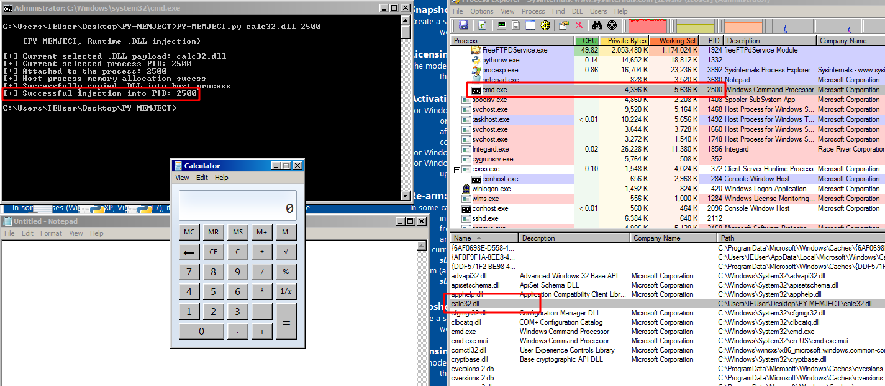

##### PY-MEMJECT: A Windows runtime .DLL injection tool that allows for malicious code to run in another processes memory

[](https://www.python.org/)

----

**Usage:**
```
      ./PY-MEMJECT.py <DLL PATH> <process PID>
```



----

**About:**
```
Windows API functions process goes as follows:

     OpenProcess() --> Injector attaches to host process
           |---> VirtualAllocEx() --> Memory allocates for host process
                 |---> WriteProcessMemory() --> Copy DLL to host process
                      |---> CreateRemoteThread() --> Code execution

```

*Preface:* There are a couple of types of DLL injection, this utilizes the "Runtime" injection method, which is a legitimate Win32API usage, using only Win32API functions we can inject a malicious DLL path into other running processes. DLL injection is a very common behavior of malware, with over 40% of malware having the capability to inject itself or other malicious code into running processes, usually to establish persistence on a system. DLL injection is also commonly found in video game cheating, where a user can inject a cheat menu into the game.

*Breaking down the Windows API functions:* There are four main steps to injecting a DLL payload into a running processes. The steps are simply to first attach and set up a handler to a running process which will allow us to communicate with it. Then you will allocate a space in memory in the host (victim) process that you are injecting. Then, you will inject and copy the malicious DLLs path into that host processes allocated space. And finally calling a function with the address of the LoadLibrary function which causes the injected DLL file's path to be loaded into memory and executed via the infected process.


   1. [**OpenProcess()**](https://docs.microsoft.com/en-us/windows/win32/api/processthreadsapi/nf-processthreadsapi-openprocess) Is responsible for setting up access to a process object and returning a handle to us as a means of communication with the process we select.
   2. [ **VirtualAllocEx()**](https://docs.microsoft.com/en-us/windows/win32/api/memoryapi/nf-memoryapi-virtualallocex). In the context of DLL injection, this function is responsible for allocating memory space in the victim process for the malicious DLLs path to be injected. 
   3. [**WriteProcessMemory()**](https://docs.microsoft.com/en-us/windows/win32/api/memoryapi/nf-memoryapi-writeprocessmemory). Is responsible for writing the malicious DLL path to the area of memory that has been allocated with the previous step. 
   4. [**LoadLibraryA**](https://docs.microsoft.com/en-us/windows/win32/api/libloaderapi/nf-libloaderapi-loadlibrarya) Have LoadLibraryA the address of kernel32.dll since kernel32.dll is mapped to the same address in almost every process. And LoadLibraryA is a function within kernel32.dll. And LoadLibraryA also happens to fit the thread start routine needed by CreateRemoteThread().
   5. [**CreateRemoteThread()**](https://docs.microsoft.com/en-us/windows/win32/api/processthreadsapi/nf-processthreadsapi-createremotethread). Calling CreateRemoteThread() and passing it the address of LoadLIbrary causes the injected path of the malicious DLL to be loaded into memory and executed.
   
### Disclaimer
>This tool is only for testing and academic purposes and can only be used where strict consent has been given. Do not use it for illegal purposes! It is the end user’s responsibility to obey all applicable local, state and federal laws. Developers assume no liability and are not responsible for any misuse or damage caused by this tool and software in general.

